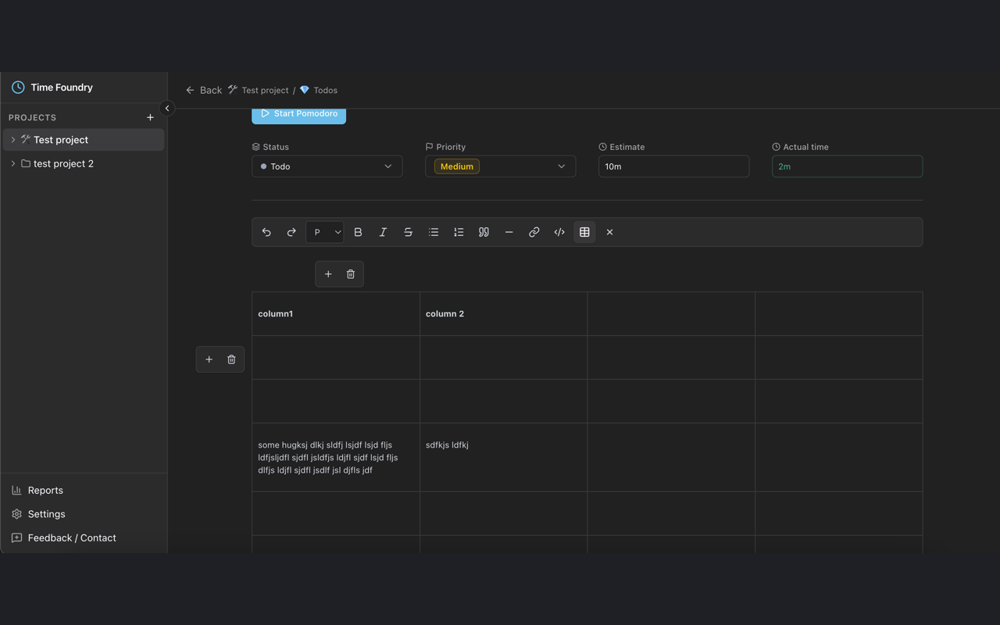
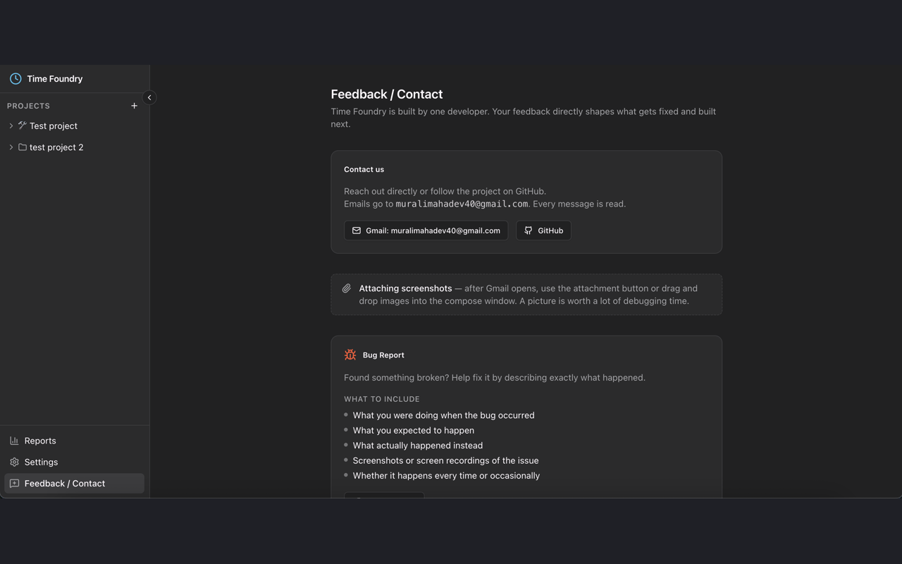

# Time Foundry

Time Foundry is a local-first Pomodoro timer, task manager, and focus tracker for developers working in VS Code.

## Features

- Open Time Foundry from the Command Palette or status bar.
- Watch the active timer in the VS Code status bar while you code.
- Pause, resume, or stop the active timer from status bar controls.
- Manage projects, lists, tasks, estimates, notes, and project statuses.
- Run Pomodoro or free-form focus sessions tied to tasks.
- Track completed and interrupted sessions locally.
- Export all local data to JSON and import it on another machine from Settings or the Command Palette.
- Keep data on your machine with no account, cloud sync, or API dependency.

## Getting Started

1. Install Time Foundry.
2. Run `Time Foundry: Open` or click Time Foundry in the status bar.
3. Create a project and list, then add tasks.
4. Start a focus session from a task.

> `onCommand:timeFoundry.open` is an activation event in the manifest. In VS Code, run the command named `Time Foundry: Open`.

## Import and Export

Use the Data section in Settings, or these commands from the Command Palette:

- `Time Foundry: Export Data`
- `Time Foundry: Import Data`

Export creates a `.json` file containing projects, lists, tasks, sessions, settings, timer state, pending sessions, task minutes, and UI filters. Import replaces the current local Time Foundry data on the target machine after confirmation.

## Commands

- `Time Foundry: Open`
- `Time Foundry: Start Timer`
- `Time Foundry: Pause Timer`
- `Time Foundry: Resume Timer`
- `Time Foundry: Stop Timer`
- `Time Foundry: Export Data`
- `Time Foundry: Import Data`

## Screenshots

## Privacy

Time Foundry stores data locally in VS Code/webview storage. It does not send your tasks, session history, settings, or timer data to a remote service.

## Support

- Report issues: https://github.com/Murali-mahadeva-BS/time-foundry/issues
- Source code: https://github.com/Murali-mahadeva-BS/time-foundry
